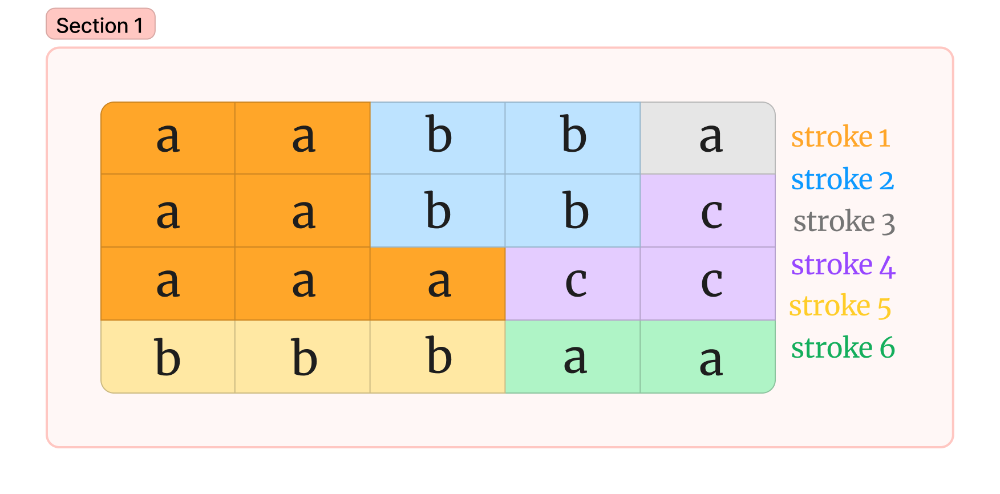

# Javascript exercise I got in a mock interview:

- Function receives an array containing strings
* Each string represents a row, each letter of the string represents a column position
* So original array work as a grid/matrix containing letters

- When comparing each letter as a grid, if they're surrounded (row or column) by another letter (same one), then both grid squares should be painted the same color
  
- Question is: given some strings, how many colors will be needed to paint the whole grid according to said rule?
* Keep in mind: if a letter set is separated from another one (i.e., the letter already appear), they should have different colors either way. What's important is comparing according to immediate surroundings

### EXAMPLE: the function receives the following array: ["aabba","aabbc","aaacc","bbbaa"]
- this will create a 4x5 matrix, pictured below

 </img>
 
### we will need 6 strokes to paint the whole matrix
